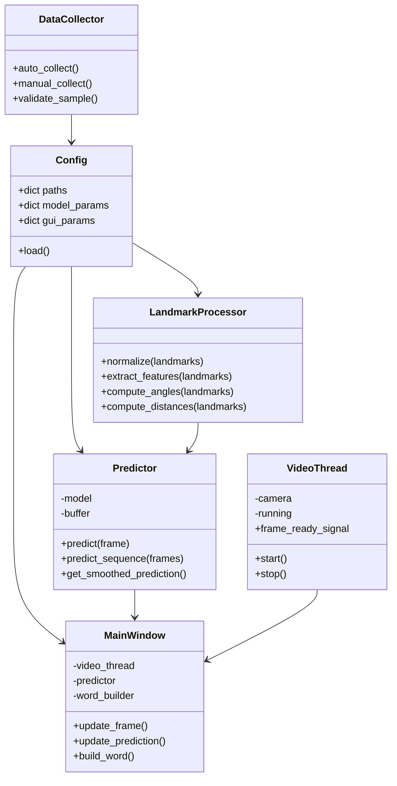

# Sign Language Detection Project - Improvements PRD

## 1. Executive Summary

This document outlines a comprehensive improvement roadmap for the Sign Language Detection project, combining strategic feature enhancements with critical bug fixes to evolve the system from a functional prototype into a robust, industry-ready real-time AI application.

## 2. Current State Analysis

### 2.1 Existing Architecture
- MediaPipe-based hand landmark extraction (21 landmarks × 3 coordinates = 63 features)
- MLP neural network classifier (256→128→26 neurons)
- Manual dataset collection with .npy file storage
- Tkinter-based real-time GUI with webcam inference
- Single-frame prediction approach

### 2.2 Critical Issues Identified

#### Code-Level Issues
| Issue | Severity | Impact |
|-------|----------|--------|
| No error handling | Critical | Application crashes on camera/model failures |
| GUI runs on main thread | Critical | Interface freezes during prediction |
| Data imbalance (X,Y,Z: 20 samples vs A: 100) | Critical | Poor recognition for underrepresented letters |
| Model loads at import time | High | Slow startup, crashes if model missing |
| No prediction smoothing | High | Flickering predictions between similar letters |
| Code duplication | Medium | `normalize_landmarks()` in multiple files |
| Hardcoded paths | Medium | Reduced portability across systems |
| No logging system | Medium | Difficult debugging and monitoring |

#### Architecture Issues
| Issue | Severity | Impact |
|-------|----------|--------|
| Single-frame prediction | High | No temporal context, unstable recognition |
| No data augmentation | High | Limited generalization to variations |
| Manual data collection only | Medium | Time-consuming, inconsistent quality |
| No evaluation metrics | Medium | Cannot measure per-class performance |
| No configuration management | Low | Parameters scattered across files |

## 3. Objectives

### Primary Objectives
1. **Stability**: Eliminate crashes and GUI freezing
2. **Accuracy**: Improve recognition accuracy by ≥15% through temporal learning
3. **Usability**: Enable assistive communication with word formation
4. **Quality**: Implement professional evaluation and monitoring
5. **Maintainability**: Modular architecture with clear separation of concerns

### Success Metrics
- Zero crashes during normal operation
- ≥90% per-class accuracy (currently imbalanced)
- <100ms inference latency maintained
- Prediction stability: ≤1 flicker per 5 seconds
- Word formation capability for sentences

## 4. Functional Requirements

### 4.1 Critical Bug Fixes (Phase 0)

#### F-0.1: Error Handling & Robustness
- **Requirement**: Wrap all I/O operations (camera, model loading, file access) in try-except blocks
- **Acceptance Criteria**: 
  - Graceful degradation when camera unavailable
  - Informative error messages to user
  - Application continues running after recoverable errors

#### F-0.2: Threading Architecture
- **Requirement**: Move camera capture and inference to separate thread(s)
- **Acceptance Criteria**:
  - GUI remains responsive during prediction
  - Smooth 30 FPS video display
  - Thread-safe communication between inference and UI

#### F-0.3: Data Balance Correction
- **Requirement**: Collect additional samples for underrepresented classes (X, Y, Z)
- **Acceptance Criteria**:
  - Minimum 80 samples per class (currently 20 for X, Y, Z)
  - Balanced class distribution (±10% variance)

### 4.2 Core Improvements (Phase 1)

#### F-1.1: Prediction Stabilization
- **Requirement**: Implement prediction buffering with majority voting
- **Implementation**: Circular buffer of last 10 predictions, output most frequent
- **Acceptance Criteria**:
  - Flicker rate reduced by ≥80%
  - Latency increase <100ms

#### F-1.2: Automatic Data Collection
- **Requirement**: Auto-capture samples when hand detected and stable
- **Implementation**: 
  - Trigger: Hand detected for 500ms with <5% landmark movement
  - Rate: 1 sample per 300ms
  - Count display: Show samples collected per letter
- **Acceptance Criteria**:
  - 50% reduction in collection time
  - Quality filter rejects blurry/unstable frames

#### F-1.3: Evaluation Metrics Dashboard
- **Requirement**: Generate confusion matrix and per-class metrics after training
- **Metrics**: Precision, Recall, F1-score per class; Overall accuracy
- **Acceptance Criteria**:
  - Metrics exported to JSON/CSV
  - Visual confusion matrix saved as image
  - Identifies worst-performing classes for targeted improvement

### 4.3 Advanced Features (Phase 2)

#### F-2.1: Temporal Learning (LSTM Model)
- **Requirement**: Implement sequence-based prediction using LSTM
- **Implementation**:
  - Input: Sliding window of last 20 frames (20 × 63 features)
  - Architecture: LSTM(128) → Dense(64) → Dense(26, softmax)
  - Training: Sequence generation from existing data
- **Acceptance Criteria**:
  - ≥10% accuracy improvement over single-frame MLP
  - Inference time <150ms per sequence

#### F-2.2: Feature Engineering
- **Requirement**: Extract hand geometry features beyond raw landmarks
- **Features**:
  - Finger angles (4 angles per finger)
  - Inter-finger distances (tip-to-tip, base-to-base)
  - Palm orientation (wrist to middle finger base vector)
  - Hand aspect ratio (width/height)
- **Acceptance Criteria**:
  - Feature vector expanded to 80+ dimensions
  - Improved discrimination between similar letters (M/N, S/T)

### 4.4 UI/UX Enhancements (Phase 3)

#### F-3.1: Confidence Visualization
- **Requirement**: Real-time confidence bar for top-3 predictions
- **Implementation**: Progress bars showing probability distribution
- **Acceptance Criteria**: Visual feedback updates at 10Hz

#### F-3.2: Word Formation Mode
- **Requirement**: Accumulate letters into words with space/delete controls
- **Implementation**:
  - Hold 'space' gesture (both hands open) to add space
  - 'Delete' button to remove last letter
  - Text display area showing formed word/sentence
- **Acceptance Criteria**:
  - Form sentences of 10+ words
  - Export text to clipboard

#### F-3.3: Hand Detection Indicators
- **Requirement**: Visual feedback for hand detection status
- **Implementation**: 
  - Green border when hand detected and stable
  - Red border when no hand or hand moving too fast
  - Landmark quality score (0-100%)

## 5. Non-Functional Requirements

### 5.1 Performance
- Inference latency: <100ms (single-frame), <150ms (sequence)
- Video frame rate: ≥25 FPS
- Startup time: <3 seconds

### 5.2 Reliability
- Mean time between failures: >1 hour continuous operation
- Graceful handling of all edge cases (no hand, multiple hands, occlusion)

### 5.3 Portability
- Configuration file for all paths and parameters (YAML/JSON)
- Relative paths throughout codebase
- Cross-platform compatibility (Windows, Linux, macOS)

### 5.4 Maintainability
- Modular structure: data/, models/, src/, config/
- Type hints for all functions
- Docstrings following Google style
- Logging with rotation (max 10MB per file)

## 6. Technical Architecture

### 6.1 Proposed Directory Structure
```
project/
├── config/
│   └── config.yaml          # All parameters and paths
├── data/
│   ├── raw/                 # Collected .npy files
│   ├── processed/           # Normalized, augmented data
│   └── sequences/           # LSTM sequence data
├── models/
│   ├── mlp/                 # Current MLP model
│   ├── lstm/                # New LSTM model
│   └── checkpoints/         # Training checkpoints
├── src/
│   ├── collect/
│   │   ├── auto_collect.py
│   │   └── manual_collect.py
│   ├── train/
│   │   ├── train_mlp.py
│   │   ├── train_lstm.py
│   │   └── evaluate.py
│   ├── inference/
│   │   ├── predictor.py
│   │   └── smoothing.py
│   ├── gui/
│   │   ├── main_window.py
│   │   ├── video_thread.py
│   │   └── word_builder.py
│   └── utils/
│       ├── landmarks.py     # Normalization, feature extraction
│       ├── config_loader.py
│       └── logger.py
├── logs/
│   └── app.log
├── tests/
│   └── test_*.py
└── requirements.txt
```

### 6.2 Class Diagram



## 7. Implementation Roadmap

### Phase 0: Critical Fixes (Week 1)
- [ ] Add comprehensive error handling to GUI.py
- [ ] Implement threading for video capture and inference
- [ ] Collect additional samples for X, Y, Z classes
- [ ] Create requirements.txt
- [ ] Add basic logging

### Phase 1: Core Improvements (Week 2)
- [ ] Implement prediction smoothing with majority voting
- [ ] Build automatic data collection module
- [ ] Create evaluation metrics dashboard
- [ ] Add configuration file (config.yaml)
- [ ] Refactor code to eliminate duplication

### Phase 2: Temporal Learning (Weeks 3-4)
- [ ] Implement sequence data generation
- [ ] Build and train LSTM model
- [ ] Add feature engineering (angles, distances)
- [ ] Compare LSTM vs MLP performance
- [ ] Implement model selection in GUI

### Phase 3: UI/UX & Word Formation (Weeks 5-6)
- [ ] Redesign GUI with confidence visualization
- [ ] Implement word formation system
- [ ] Add hand detection indicators
- [ ] Create prediction history display
- [ ] Add export functionality (clipboard, file)

### Phase 4: Polish & Documentation (Week 7)
- [ ] Write unit tests
- [ ] Create user documentation
- [ ] Performance profiling and optimization
- [ ] Cross-platform testing
- [ ] Portfolio-ready presentation

## 8. Risk Assessment

| Risk | Probability | Impact | Mitigation |
|------|-------------|--------|------------|
| LSTM training overfitting | Medium | High | Early stopping, dropout, data augmentation |
| Performance degradation with LSTM | Medium | Medium | Optimize sequence length, use GPU if available |
| Threading bugs (race conditions) | Medium | High | Use thread-safe queues, extensive testing |
| Data collection quality issues | Low | Medium | Validation filters, manual review option |
| UI complexity increases learning curve | Low | Low | Tooltips, tutorial mode, simple/advanced modes |

## 9. Future Enhancements (Post-MVP)

- **Sentence-level recognition**: Transformer-based sequence modeling
- **Mobile deployment**: TensorFlow Lite for Android/iOS
- **Two-hand support**: Full ASL including two-handed signs
- **Cloud API**: REST API for remote inference
- **Continuous learning**: Online model updates from user corrections

## 10. Appendix

### A. Configuration File Template (config.yaml)
```yaml
paths:
  data_dir: "./data"
  model_dir: "./models"
  log_dir: "./logs"

collection:
  auto_capture_interval_ms: 300
  stability_threshold: 0.05
  min_samples_per_class: 80

model:
  mlp:
    hidden_layers: [256, 128]
    dropout: [0.4, 0.3]
    epochs: 30
  lstm:
    sequence_length: 20
    lstm_units: 128
    dense_units: 64
    epochs: 50

inference:
  smoothing_buffer_size: 10
  confidence_threshold: 0.7
  use_lstm: false

gui:
  window_size: [900, 600]
  video_size: [700, 400]
  show_confidence_bar: true
  enable_word_mode: true
```

### B. Dependencies (requirements.txt)
```
opencv-python>=4.8.0
mediapipe>=0.10.0
tensorflow>=2.13.0
numpy>=1.24.0
scikit-learn>=1.3.0
matplotlib>=3.7.0
Pillow>=10.0.0
PyYAML>=6.0
```

---

**Document Version**: 1.0
**Last Updated**: 2026-02-24
**Status**: Draft for Review
